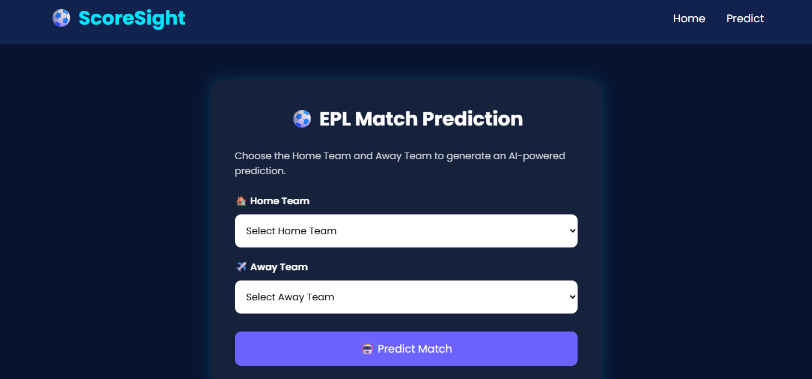
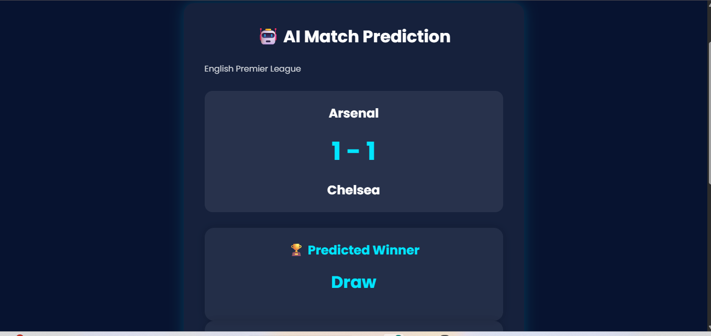
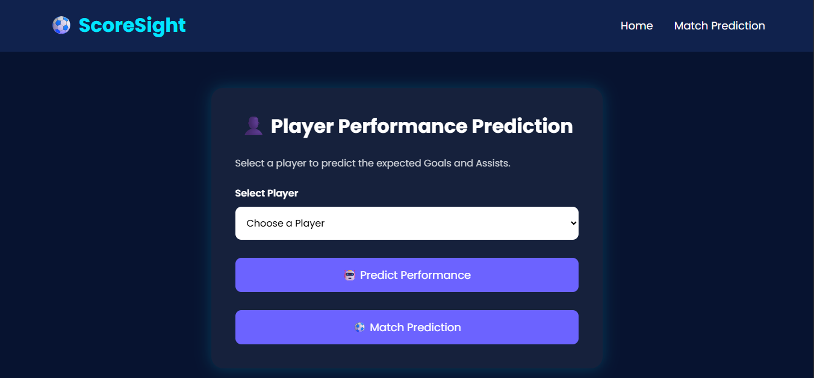

# ⚽ ScoreSight

## AI Powered Football Match & Player Prediction System

ScoreSight is an AI-powered football analytics web application that predicts English Premier League match results and player performance using Machine Learning.

---

# 🚀 Features

- ⚽ Match Score Prediction
- 🏆 Match Winner Prediction
- 👤 Player Performance Prediction
- 🎯 Goals Prediction
- 🎯 Assists Prediction
- 🤖 AI Prediction Summary
- 🌐 Modern Flask Web Application
- 📊 Random Forest Machine Learning Models

---

# 📷 Project Screenshots

## 🏠 Home Page


---

## ⚽ Match Prediction



---

## 🏆 Match Result



---

## 👤 Player Prediction



---

## 🎯 Player Result


---

# 🛠️ Technologies Used

- Python
- Flask
- HTML5
- CSS3
- JavaScript
- Pandas
- NumPy
- Scikit-Learn
- Joblib

---

# 🤖 Machine Learning Models

## Match Prediction

Model:

Random Forest Regressor

Input Features

- Home Team
- Away Team
- Season
- Stage
- Rolling Home Goals
- Rolling Away Goals
- Home Conceded
- Away Conceded

Outputs

- Home Goals
- Away Goals
- Winner

---

## Player Prediction

Model

Random Forest Regressor

Input Features

- Club
- Position
- Age
- Appearances
- Wins
- Losses
- Shots
- Passes
- Tackles
- Recoveries
- Big Chances Created

Outputs

- Predicted Goals
- Predicted Assists

---

# 📂 Folder Structure

```
ScoreSight
│
├── backend
│   ├── app.py
│   ├── predict.py
│   ├── player_predict.py
│   ├── requirements.txt
│   └── models
│
├── frontend
│   ├── static
│   └── templates
│
├── datasets
│
├── notebooks
│
├── screenshots
│
├── README.md
├── LICENSE
└── .gitignore
```

---

# ⚙️ Installation

Clone Repository

```bash
git clone https://github.com/Yeldandi-Sathwika/ScoreSight.git
```

Move into Project

```bash
cd ScoreSight
```

Install Requirements

```bash
pip install -r backend/requirements.txt
```

Run Project

```bash
cd backend
python app.py
```

---

# 📊 Project Modules

- Data Collection
- Data Preprocessing
- Feature Engineering
- Match Prediction
- Player Prediction
- Flask Backend
- Frontend UI
- Result Visualization

---

# 🔮 Future Scope

- Live EPL Data Integration
- Win Probability Prediction
- Player Recommendation System
- Injury Prediction
- Team Comparison Dashboard
- Interactive Analytics

---

# 👩‍💻 Developed By

**Yeldandi Sathwika**

B.Tech – Computer Science & Engineering (AI & ML)

Jyothishmathi Institute of Technology and Science

---

# ⭐ Support

If you like this project, please ⭐ star the repository.